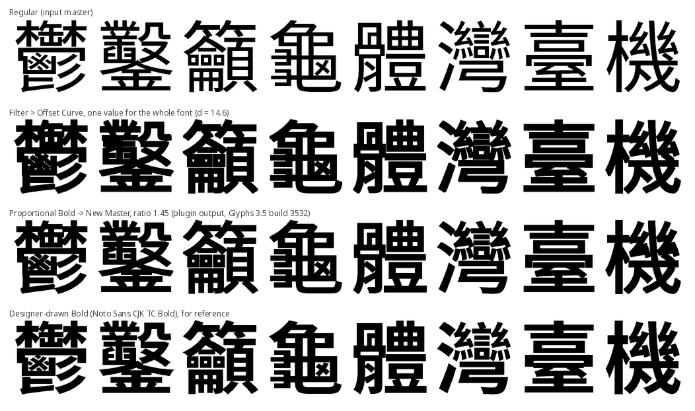

# Proportional Bold → New Master（比例加粗 → 新增母版）

Glyphs 3 與 Glyphs 4 的外掛。你只給一個數字——目標筆畫比例——它就在字型裡新增一個**母版**，每個字依「自己的筆畫粗細」按比例加粗。得到的是 Bold 或 Black 母版的**草稿**，不是完成的字重。

四行分別是：Regular 母版；Filter > Offset Curve 對整套字型用同一個值；本外掛 ratio 1.45（實際輸出）；思源黑體 TC 設計師手繪的 Bold，供對照。

## 為什麼

`Filter > Offset Curve` 對每個字加同樣的量。CJK 的 Regular 母版本來就有筆畫層級——在思源黑體 TC 裡，一 的筆畫 82 units，灣 只有 46——同一個常數會讓密集字相對粗得多、把 counter 糊死。本外掛用掃描線量每個字的筆畫粗細，用 Glyphs 自己的 Offset Curve 引擎外推 `(ratio − 1) / 2 × 該字筆寬`。這條規則很舊（Sharp 1998、Canon 1993 的專利，皆已失效）；外掛只是把它放進字型編輯器。

## 值多少，用數據講

實際外掛輸出，思源黑體 TC Regular → ratio 1.45，與設計師手繪的 Bold 比較（[run 35503951963](mac/results/35503951963/)）：

| | 本外掛 | 單一 Offset Curve 值 |
|---|---|---|
| 與設計師 Bold 的 IoU，412 字 | 0.831 | 0.829 |
| 設計師保留而這裡被封死的 counter，出現在幾成字裡，412 字 | 18.4 % | 22.1 % |
| 同上，318 個 CJK 漢字 | 23.9 % | 28.6 % |

也就是：整體吻合度與單一外推值相同，密集字 counter 糊掉的比例少了大約六分之一。沒有比這更強的說法。設計師仍然要重畫交叉處、重新分配筆畫間距、逐字修密集字；這個外掛省的是第一遍。

## 安裝

- Plugin Manager：上架之後從 *Window > Plugin Manager* 安裝。
- 手動：把 `ProportionalBold.glyphsPlugin` 複製到 `~/Library/Application Support/Glyphs 3/Plugins/`（或 `Glyphs 4/Plugins/`），重新啟動 Glyphs。
- 需要 *Window > Plugin Manager > Modules* 裡的 Python 模組：Glyphs 3 用它的 Python 3.11 模組，Glyphs 4 用它的 Python 3.14 模組（見下方驗證）。不需要其他模組。

## 使用

選好要加粗的母版，*Edit > 比例加粗 → 新增母版…*，輸入比例（Bold ≈ 1.45、Black ≈ 1.75，思源黑體實測），按 *Create Master*。會新增一個名為 `<目前母版> PropBold <ratio>` 的母版；其中的組件已拆解；每個新圖層的 `userData["proportionalBold"]` 記錄量到的筆寬與外推量。量不到筆畫的字（點、極小符號）用全字型的中位筆寬，並列在報告裡。新增母版不能復原——反悔就到 Font Info 刪掉它。

## 驗證環境

Glyphs 3.5（build 3532）與 Glyphs 4.1（build 4107），GitHub Actions 的 macOS runner，無頭與 GUI 都跑：外掛載入、選單項目出現、415 個測試字中 413 個加粗、1 個 fallback、0 個失敗。兩個版本的輸出逐字比對：IoU 平均 0.9998、最低 0.9949（414 字中 292 字完全相同）；與命令列工具相比，IoU 平均 0.994、最低 0.980。紀錄與數字：[mac/results/](mac/results/)。

## 已知限制

- 掃描線找到的墨段不足六段的字（點、極小符號）用中位筆寬，不是自己的。
- 尖銳的斜筆尖端（撇、捺）比命令列工具的短，因為兩邊的外推引擎不同；面積差異 1 % 以內。
- 密集字仍然要手工修；交叉處沒有處理。
- 65,535 字在 3 核心的 runner 上約 13–17 分鐘。

## 命令列

`propbold`（0.2.0）在 Glyphs 之外套用同一條規則，Windows、macOS、Linux 皆可：`.glyphs` 進 → 同一個檔加一個母版、`.ufo` → 新 UFO、`.otf`/`.ttf` → 新的 TrueType 字型。`propbold-compare` 把外掛做的母版與命令列輸出對照；`--report` 不需要任何參考字重，直接列出手修清單（封死的 counter、替代筆寬）。

    pip install "git+https://github.com/fanzhixiang777/ProportionalBold.git#subdirectory=propbold-cli"
    propbold NotoSansCJKtc-Regular.otf --ratio 1.45

TTF 輸出已在 Windows 11 驗證（2026-09-20，propbold 0.2.0：65,535 字 541 秒、ots 通過、可安裝、Word 列出並正常渲染——[mac/results/windows-0.2.0.md](mac/results/windows-0.2.0.md)）。細節：[propbold-cli/README.md](propbold-cli/README.md)。

## 代工服務

不想自己跑也可以：把 Regular 母版寄來，我用這套工具做出 Bold 或 Black 的草稿母版交回，並附一份清單，列出 counter 被封死或改用替代筆寬的每一個字，讓你知道從哪裡開始手修。每一套字重 NT$20,000（約 US$620）。先免費做你挑的 50 個字當樣本，親眼看過再決定要不要付費。你的檔案只用於這件工作，交件後刪除。來信 proportionalbold@gmail.com。

If you would rather not run it yourself: send a Regular master and I return the Bold or Black draft master made with this tool, plus a report listing every glyph that lost a counter or used the fallback stem, so you know where to start by hand. NT$20,000 (about US$620) per weight set. A free sample of 50 glyphs of your choice comes first, so you can judge it by eye before paying. Your files are used only for this job and deleted after delivery. Write to proportionalbold@gmail.com.

ご自身で実行されない場合は、Regular マスターをお送りいただければ、このツールで作成した Bold または Black の下書きマスターと、カウンターが閉じたグリフや代替ステム幅を使ったグリフをすべて列挙したレポートをお返しします — どこから手作業を始めるべきかが分かります。ウェイト一式につき NT$20,000（約 US$620）です。まず、お選びいただいた 50 字のサンプルを無料でお作りしますので、目でご確認のうえお支払いをご判断ください。お預かりしたファイルはこの作業にのみ使用し、納品後に削除します。連絡先は proportionalbold@gmail.com です。

清單由 `propbold-compare --report` 產生；驗證那一輪的範例：[docs/report-example.txt](docs/report-example.txt)。

問題回報與提問：在 GitHub 開 issue，或來信 proportionalbold@gmail.com。

Bugs and questions: open an issue on GitHub, or write to proportionalbold@gmail.com.

不具合の報告やご質問は、GitHub で issue を開くか、proportionalbold@gmail.com までお寄せください。

## 授權

MIT。測試資料：思源黑體（SIL Open Font License）。
